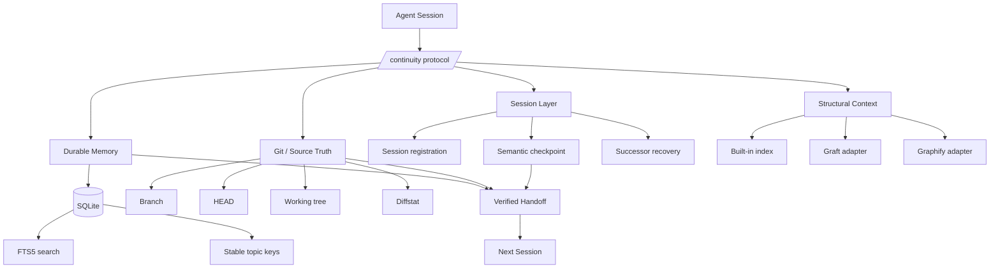

<div align="center">


<br />

# Continuity

### Persistent context for coding agents.

**Memory · Structure · Handoffs · Recovery**

[](https://www.python.org/)
[](LICENSE)
[](https://github.com/kingju1c3/continuity/actions/workflows/test.yml)
[](docs/HOSTS.md)
[](docs/HOSTS.md)
[](#privacy-and-security)

**Pick up where the last session stopped — with durable memory, codebase orientation, Git-verified handoffs, and host-aware session recovery.**

[Quick Start](#quick-start) · [How It Works](#how-continuity-works) · [Installation](#installation) · [Usage](#usage) · [CLI Reference](#cli-reference) · [Architecture](#architecture) · [Troubleshooting](#troubleshooting)

</div>

---

## What is Continuity?

Coding agents are powerful inside a session and surprisingly fragile across sessions.

A long-running task may involve dozens of decisions, discovered edge cases, partial fixes, architectural constraints, changed files, failed approaches, verification steps, and unresolved next actions. Then the session ends, the context window compacts, a new terminal opens, or a different agent takes over.

The next session often starts with only fragments:

- a Git working tree,
- maybe a transcript,
- maybe a summary,
- maybe some project instructions,
- and no reliable distinction between **what was discussed**, **what was decided**, **what was actually changed**, and **what still needs to happen**.

**Continuity is a local-first continuity layer for coding agents.**

It does not pretend that a new model invocation is literally the same running process. Instead, it builds the strongest practical approximation of continuity from durable, inspectable evidence:

1. **Curated memory** for durable decisions and discoveries.
2. **Structural context** for understanding where things live in the codebase.
3. **Session state** for tracking work across agent runs.
4. **Verified handoffs** that pair semantic summaries with current Git evidence.
5. **Host integration** that restores context at session start and prompts checkpointing before compaction or exit.
6. **Optional graph adapters** for deeper orientation through Graft and Graphify.

The result is a successor session that can begin with far more than “read the repo and figure out what happened.”

---

## Why Continuity exists

Most continuity systems collapse several very different kinds of information into one bucket.

Continuity deliberately does not.

> A transcript is not memory.  
> A memory is not source truth.  
> A code graph is not a handoff.  
> A handoff is not the working tree.  
> A summary is not verification.

Each layer answers a different question:

| Layer | Question it answers | Authority |
|---|---|---|
| **Current source + Git** | What is true in the project right now? | Highest |
| **Structural index / graph** | Where is this implemented and how is it connected? | Derived from source |
| **Durable memory** | What did we learn, decide, or standardize? | Historical context |
| **Session handoff** | What was happening, what is done, and what happens next? | Predecessor account + Git snapshot |
| **Transcript** | What was said during a session? | Raw history, usually too noisy |

This separation is the core design decision behind Continuity.

---

## Core capabilities

### 1. Durable project memory

Continuity stores curated memories in a local SQLite database with FTS5 full-text search.

Use it for knowledge that should survive the current session:

- architectural decisions,
- conventions,
- root causes,
- non-obvious discoveries,
- environment/configuration decisions,
- user constraints,
- implementation patterns,
- gotchas that would otherwise need to be rediscovered.

It is intentionally **not** a transcript sink.

A good memory is small, structured, searchable, and expensive to rediscover.

---

### 2. Stable evolving topics

Durable knowledge changes.

Instead of creating ten contradictory memories about the same evolving design, Continuity supports stable topic keys:

```bash
continuity remember   "Authentication model"   "**What**: Switched from JWT-only auth to server-side sessions.
**Why**: Revocation and device management requirements.
**Where**: src/auth/, middleware/session.py
**Learned**: Existing refresh-token assumptions must be removed."   --kind architecture   --topic architecture/auth-model
```

Saving another memory with the same project + topic key updates that topic rather than creating a competing copy.

---

### 3. Codebase orientation

Continuity contains a zero-third-party-dependency local structural index.

The built-in index extracts:

- files,
- languages,
- file digests,
- Python classes,
- Python functions,
- Python imports,
- common symbol declarations in other languages,
- common import relationships.

This enables fast questions such as:

```bash
continuity find AuthService
continuity graph auth
continuity query "where is retry policy implemented?"
```

The structural index is a **regenerable cache**. Source code remains canonical.

---

### 4. Optional Graft + Graphify adapters

Continuity is standalone, but it can use specialized tools when they are already installed.

**Graft** is preferred for codebase-orientation queries when available.

**Graphify** can be used when its persistent graph exists for richer relationship queries.

The fallback order is intentionally layered:

```text
Known source location
      ↓
Continuity local index
      ↓
Graft / Graphify when available
      ↓
Broad raw search / file traversal
```

That keeps simple tasks cheap while allowing richer graph tooling when useful.

---

### 5. Git-evidenced handoffs

Before a session ends, ownership transfers, or context is at risk, Continuity can create a semantic checkpoint containing:

- current goal,
- active instructions and constraints,
- discoveries,
- accomplished work,
- exact next steps,
- relevant files,
- verification already performed,
- verification still missing.

Continuity then adds mechanical Git evidence:

- repository root,
- branch,
- HEAD commit,
- working-tree status,
- diffstat.

A successor therefore receives both:

**“Here is what the previous agent believed.”**

and

**“Here is what Git says the project looked like.”**

That distinction matters.

---

### 6. Session recovery

At a new session:

```bash
continuity start --host codex --emit-context
```

Continuity resolves the project, registers the session, and emits the latest handoff when one exists.

A successor can then run:

```bash
continuity orient
continuity resume
```

and begin from the previous session’s unresolved work instead of rediscovering the project from scratch.

---

### 7. Claude Code and Codex integration

Continuity can install host-specific skill/instruction files and lifecycle hooks.

For Claude Code it installs:

```text
.claude/
└── skills/
    └── continuity/
        └── SKILL.md
```

and augments supported lifecycle hooks in:

```text
.claude/settings.json
```

For Codex it installs:

```text
.agents/
└── skills/
    └── continuity/
        └── SKILL.md
```

adds a marker-fenced Continuity section to:

```text
AGENTS.md
```

and, when a Codex user configuration directory exists, adds Continuity lifecycle hooks while preserving unrelated entries in:

```text
~/.codex/hooks.json
```

See [Host Integration](docs/HOSTS.md).

---

## Design goals

Continuity is built around several constraints.

### Evidence over narrative

If memory says one thing and the source says another, source wins.

If a checkpoint claims a file was changed but the Git state does not support that claim, the mismatch should be surfaced.

### Curated memory over raw transcript accumulation

Storing everything feels comprehensive but produces noisy retrieval and stale contradictions.

Continuity saves the things future sessions should actually reuse.

### Project isolation

Memory, sessions, structural data, and handoffs are project-scoped.

Continuity does not silently restore context from an unrelated project.

### Local-first operation

The default store is local SQLite:

```text
~/.continuity/continuity.db
```

No hosted database or network service is required.

### Fail visibly

If continuity state is missing, stale, ambiguous, or inconsistent, the correct behavior is to report that condition — not fabricate continuity.

---

# Quick Start

## Requirements

- **Python 3.11+**
- **Git** strongly recommended
- macOS, Linux, or Windows with a compatible Python environment
- Claude Code and/or Codex are optional; the CLI also works manually

Check Python:

```bash
python3 --version
```

---

## 1. Install Continuity

### Recommended: install directly from GitHub

```bash
python3 -m pip install "git+https://github.com/kingju1c3/continuity.git"
```

Then verify:

```bash
continuity --help
```

### Development/editable installation

```bash
git clone https://github.com/kingju1c3/continuity.git
cd continuity
python3 -m pip install -e .
```

This is the best option when contributing to Continuity itself.

---

## 2. Go to the project you want Continuity to manage

```bash
cd /path/to/your/project
```

Continuity resolves the Git top-level directory automatically when the current directory belongs to a Git repository.

---

## 3. Install host integration

For both Claude Code and Codex:

```bash
continuity install --agents claude,codex
```

Claude only:

```bash
continuity install --agents claude
```

Codex only:

```bash
continuity install --agents codex
```

---

## 4. Verify the installation

```bash
continuity doctor
```

Example shape:

```json
{
  "python": "3.11.x",
  "project": "/path/to/project",
  "database": "/Users/you/.continuity/continuity.db",
  "sqlite_fts5": true,
  "graft": false,
  "graphify": false,
  "claude_skill": true,
  "codex_skill": true,
  "agents_md": true
}
```

Graft and Graphify may correctly show `false`; they are optional.

---

## 5. Build the initial structural index

```bash
continuity index
```

Example:

```json
{
  "files": 184,
  "symbols": 947,
  "edges": 426
}
```

---

## 6. Start your first session

Codex:

```bash
continuity start --host codex --emit-context
```

Claude Code:

```bash
continuity start --host claude --emit-context
```

Generic/manual use:

```bash
continuity start --host manual --emit-context
```

On the first run you may see:

```text
No previous handoff recorded.
```

That is expected.

---

# How Continuity works

A healthy Continuity workflow follows a simple lifecycle:

```text
┌──────────────────────────────┐
│ 1. SESSION START             │
│ start → recover → orient     │
└──────────────┬───────────────┘
               │
               ▼
┌──────────────────────────────┐
│ 2. WORK                      │
│ source + graph + memory      │
└──────────────┬───────────────┘
               │
               ▼
┌──────────────────────────────┐
│ 3. DURABLE LEARNINGS         │
│ remember important knowledge │
└──────────────┬───────────────┘
               │
               ▼
┌──────────────────────────────┐
│ 4. CHECKPOINT                │
│ semantic state + Git evidence│
└──────────────┬───────────────┘
               │
               ▼
┌──────────────────────────────┐
│ 5. SUCCESSOR SESSION         │
│ resume → verify → continue   │
└──────────────────────────────┘
```

---

## Session opening protocol

When beginning related project work:

```bash
continuity start --host codex --emit-context
continuity orient
```

If a prior handoff exists:

```bash
continuity resume
```

Then verify that the checkpoint still matches reality:

- same repository root?
- expected branch?
- expected HEAD?
- expected modified files?
- relevant files still exist?
- someone else committed changes after the handoff?

Only then continue from the recorded next action.

---

## During the session

### Search memory before re-solving known problems

```bash
continuity recall "database migration"
```

```bash
continuity recall "authentication"
```

```bash
continuity recall "why did we choose sqlite"
```

### Use the structural layer before reading the whole repository

```bash
continuity find SessionManager
```

```bash
continuity graph session
```

```bash
continuity query "where does the app initialize database state?"
```

### Refresh the index after meaningful structural changes

```bash
continuity index
```

Especially useful after:

- moving files,
- adding modules,
- renaming classes,
- reorganizing packages,
- modifying import topology,
- large refactors.

---

# Durable memory

## What should be remembered?

A simple test:

> Would a future session waste meaningful time or make a worse decision if this knowledge disappeared?

If yes, it is probably worth saving.

Good examples:

- “Authentication now uses server-side sessions.”
- “Do not call this API from the browser; it requires a service credential.”
- “The flaky test was caused by a shared temporary directory.”
- “This project intentionally keeps generated graph state out of Git.”
- “The migration runner must remain idempotent.”
- “The user explicitly chose approach B over approach A.”

Poor examples:

- raw compiler output,
- every shell command,
- a transient test count,
- the entire conversation,
- secrets,
- information that is trivial to re-read from one obvious source file.

---

## Recommended memory structure

Use:

```markdown
**What**: What changed or was learned.
**Why**: Why it matters.
**Where**: Relevant files/components.
**Learned**: Non-obvious constraints, edge cases, or gotchas.
```

Example:

```bash
continuity remember   "Fixed duplicate upload records"   "**What**: Reused request_id as the idempotency key.
**Why**: Automatic retries could write duplicate records.
**Where**: src/upload/handler.py, tests/test_upload.py
**Learned**: Retry handling must occur before persistence."   --kind bugfix   --topic upload/idempotency
```

---

## Memory kinds

`--kind` is free-form in the CLI, but these categories are useful conventions:

| Kind | Use |
|---|---|
| `decision` | A choice made between alternatives |
| `architecture` | System structure or design |
| `bugfix` | Root cause + completed fix |
| `discovery` | Non-obvious project knowledge |
| `pattern` | Repeatable implementation convention |
| `config` | Environment or tooling configuration |
| `preference` | Durable user/team constraint |

---

## Stable topic keys

Use `--topic` when a concept is expected to evolve.

Good:

```text
architecture/auth-model
architecture/database
config/test-runner
workflow/release-process
ui/design-system
upload/idempotency
```

Avoid reusing one topic for unrelated facts.

Topic keys are project-scoped.

---

## Pinned memories

Use `--pin` for especially important context:

```bash
continuity remember   "Production database constraint"   "Production migrations must be backward compatible with the previous app version."   --kind architecture   --topic database/migration-compat   --pin
```

Pinned memories are prioritized in memory retrieval ordering.

---

# Structural context

## Build the index

```bash
continuity index
```

The built-in index currently performs richer AST extraction for Python and conservative symbol/import extraction for several other common text/code formats.

The index skips common generated/cache locations such as:

```text
.git
.continuity
node_modules
.venv
venv
dist
build
target
__pycache__
.next
.cache
```

Very large files are also bounded to prevent accidental indexing of oversized artifacts.

---

## Find symbols

```bash
continuity find AuthService
```

Example output:

```text
src/auth/service.py:18 classdef AuthService
src/auth/test_service.py:11 symbol AuthService
```

Use `--limit` to change the result count:

```bash
continuity find AuthService --limit 30
```

---

## Inspect graph neighbors

```bash
continuity graph auth
```

Example shape:

```text
src/api.py -[imports]-> auth.service (src/api.py:7)
src/auth/service.py -[imports]-> auth.models (src/auth/service.py:3)
```

This is intentionally a lightweight graph, not a replacement for full static analysis.

---

## Ask a structural question

```bash
continuity query "where is retry handling implemented?"
```

Query behavior:

1. use Graft if installed and available;
2. otherwise use Graphify when installed and a Graphify graph exists;
3. otherwise fall back to Continuity's local structural search.

This lets Continuity remain useful with zero optional dependencies while taking advantage of specialized tooling when present.

---

# Checkpoints and handoffs

A checkpoint should let a competent successor continue without reconstructing the entire session.

## Create a checkpoint

```bash
continuity checkpoint   --host codex   --goal "Finish retry-safe upload handling"   --instructions "Preserve API compatibility; do not change response schema"   --discoveries "Duplicate writes occur when timeout retries race the first request"   --accomplished "Added idempotency check and unit coverage"   --next-steps "Run integration suite; inspect concurrent retry path; then update docs"   --relevant-files "src/upload/handler.py tests/test_upload.py docs/uploads.md"   --verification "Unit tests pass; integration suite has not been run"
```

Continuity automatically captures Git state at checkpoint time.

---

## Handoff content

A generated handoff contains sections similar to:

```markdown
# Continuity Handoff

- Created: ...
- Host: codex
- Session: ...
- Project: /path/to/project
- Branch: feature/retry-safe-upload
- HEAD: abc123...

## Goal
...

## Instructions / Constraints
...

## Discoveries
...

## Accomplished
...

## Next Steps
...

## Relevant Files
...

## Verification
...

## Working Tree
...

## Diffstat
...
```

---

## Where handoffs live

The durable handoff record is stored in the Continuity database.

For inspectability, the current project also receives local mirrors:

```text
.continuity/
├── LATEST.md
├── LATEST.json
└── handoffs/
    └── <timestamp>-<session>.md
```

The installer creates:

```text
.continuity/.gitignore
```

so runtime continuity state is not accidentally committed by default.

---

## Resume from the latest handoff

```bash
continuity resume
```

A successor should compare the checkpoint against current source and Git state before acting.

---

# Usage

## Standard Codex workflow

### Start

```bash
continuity start --host codex --emit-context
continuity orient
```

### Work

```bash
continuity recall "relevant topic"
continuity query "where does X happen?"
continuity find SomeSymbol
```

### Save an important discovery

```bash
continuity remember   "Discovered cache invalidation rule"   "**What**: Cache keys include tenant ID.
**Why**: Cross-tenant collisions are otherwise possible.
**Where**: src/cache/key.py
**Learned**: Never build the key from resource ID alone."   --kind discovery   --topic cache/key-format
```

### Refresh structure after code changes

```bash
continuity index
```

### Hand off

```bash
continuity checkpoint   --host codex   --goal "..."   --accomplished "..."   --next-steps "..."   --verification "..."
```

---

## Standard Claude Code workflow

The workflow is the same; identify the host as Claude:

```bash
continuity start --host claude --emit-context
continuity orient
```

Install the Claude integration once per project:

```bash
continuity install --agents claude
```

The installed skill instructs the agent to follow the same memory/orientation/checkpoint protocol.

---

## Manual / other-agent workflow

Continuity does not require MCP.

Any agent or human that can execute shell commands can use:

```bash
continuity start --host manual --emit-context
continuity orient
continuity recall "..."
continuity query "..."
continuity remember "..." "..."
continuity checkpoint ...
continuity resume
```

This makes Continuity usable with other coding agents even when no dedicated installer exists.

---

# CLI reference

Global syntax:

```text
continuity [--path PATH] <command> [arguments]
```

The global `--path` flag appears **before** the command:

```bash
continuity --path /path/to/repo doctor
continuity --path /path/to/repo index
```

If omitted, Continuity uses the current directory and resolves its Git root when possible.

---

## `continuity start`

Register a session and optionally emit recovered context.

```bash
continuity start   [--host HOST]   [--session SESSION_ID]   [--emit-context]
```

Examples:

```bash
continuity start --host codex --emit-context
continuity start --host claude --emit-context
continuity start --host manual
```

If no explicit session ID is supplied, Continuity uses `CONTINUITY_SESSION_ID` when available, otherwise generates one.

---

## `continuity orient`

Print high-level project orientation:

- project root,
- branch,
- HEAD,
- latest handoff,
- recent durable memories,
- optional adapter availability.

```bash
continuity orient
```

This is one of the best commands to run immediately after `start`.

---

## `continuity remember`

Save a durable memory.

```bash
continuity remember TITLE [CONTENT]   [--kind KIND]   [--topic TOPIC_KEY]   [--session SESSION_ID]   [--pin]
```

If `CONTENT` is omitted, content can be read from stdin:

```bash
cat decision.md | continuity remember   "Authentication design"   --kind architecture   --topic architecture/auth
```

---

## `continuity recall`

Search project memory.

```bash
continuity recall [QUERY] [--limit N]
```

Examples:

```bash
continuity recall "auth"
continuity recall "migration rollback" --limit 15
continuity recall
```

An empty query returns recent project memory ordered with pinned items first.

---

## `continuity index`

Rebuild the built-in project structural index.

```bash
continuity index
```

Run it initially and after meaningful structural code changes.

---

## `continuity find`

Search indexed symbols and paths.

```bash
continuity find TERM [--limit N]
```

Example:

```bash
continuity find DatabaseManager --limit 25
```

---

## `continuity graph`

Show indexed relationships involving a node/path fragment.

```bash
continuity graph NODE [--limit N]
```

Example:

```bash
continuity graph database
```

---

## `continuity query`

Ask a structural question.

```bash
continuity query "QUESTION" [--limit N]
```

Example:

```bash
continuity query "where is request authentication enforced?"
```

The command can delegate to Graft/Graphify when available, otherwise it uses local indexed data.

---

## `continuity checkpoint`

Persist a successor-ready handoff.

```bash
continuity checkpoint   [--session SESSION_ID]   [--host HOST]   [--goal TEXT]   [--instructions TEXT]   [--discoveries TEXT]   [--accomplished TEXT]   [--next-steps TEXT]   [--relevant-files TEXT]   [--verification TEXT]
```

All semantic fields are optional at the parser level, but useful handoffs should populate the fields that matter.

---

## `continuity resume`

Print the newest handoff for the current project.

```bash
continuity resume
```

If no handoff exists, Continuity reports that explicitly.

---

## `continuity install`

Install repository integration.

```bash
continuity install --agents claude,codex
```

Other examples:

```bash
continuity install --agents claude
continuity install --agents codex
```

---

## `continuity doctor`

Inspect the current Continuity environment.

```bash
continuity doctor
```

Checks include:

- Python version,
- resolved project,
- database path,
- FTS5 availability,
- Graft availability,
- Graphify availability,
- Claude skill wiring,
- Codex skill wiring,
- `AGENTS.md` presence.

---

## `continuity hook`

Internal lifecycle entry point used by host integration:

```bash
continuity hook --host claude
continuity hook --host codex
```

Most users should not need to invoke this command manually.

---

# Automatic continuity

Host hooks can automate parts of the continuity lifecycle.

Continuity currently aims to automate what can be automated **reliably**:

- session registration,
- awareness that prior handoff state exists,
- restoration instructions at session opening,
- checkpoint reminders before compaction,
- checkpoint reminders at stop/end events.

There is an important limitation:

> A lifecycle hook cannot reliably reconstruct the agent's full semantic task state solely from process metadata.

Therefore hooks do **not** fabricate a complete checkpoint.

The semantic handoff must still represent what the working agent actually knows:

- what it was trying to do,
- what it learned,
- what it completed,
- what remains,
- what was verified.

This is a deliberate integrity boundary.

---

# Architecture



---

## Project identity

Continuity first resolves the canonical project root.

When Git is available and the directory belongs to a repository:

```bash
git rev-parse --show-toplevel
```

provides the root.

The project key is derived from:

- canonical root path,
- configured `remote.origin.url` when available.

This key scopes:

- sessions,
- memories,
- handoffs,
- file index,
- symbols,
- graph edges.

---

## SQLite store

Default database:

```text
~/.continuity/continuity.db
```

The store contains logical data for:

```text
projects
sessions
memories
memories_fts
handoffs
files
symbols
edges
```

SQLite WAL mode is enabled.

FTS5 provides searchable memory without requiring an external vector database.

---

## Source authority

Continuity follows this precedence:

```text
CURRENT SOURCE / GIT
        >
DERIVED STRUCTURAL INDEX
        >
DURABLE HISTORICAL MEMORY
        >
SESSION NARRATIVE
```

The point is not that lower layers are unimportant.

The point is that they answer different questions and can become stale.

---

# File layout

Repository:

```text
continuity/
├── .github/
│   └── workflows/
│       └── test.yml
├── continuity/
│   ├── __init__.py
│   ├── __main__.py
│   ├── adapters.py
│   ├── cli.py
│   ├── handoff.py
│   ├── hooks.py
│   ├── indexer.py
│   ├── install.py
│   ├── project.py
│   ├── store.py
│   └── SKILL.md
├── docs/
│   ├── ARCHITECTURE.md
│   ├── HOSTS.md
│   ├── MEMORY_PROTOCOL.md
│   └── SOURCES.md
├── scripts/
│   └── install.sh
├── tests/
│   ├── test_handoff.py
│   ├── test_indexer.py
│   └── test_store.py
├── LICENSE
├── README.md
├── SKILL.md
└── pyproject.toml
```

Runtime project-local state:

```text
your-project/
└── .continuity/
    ├── .gitignore
    ├── LATEST.md
    ├── LATEST.json
    └── handoffs/
```

Global local database:

```text
~/.continuity/
└── continuity.db
```

---

# Optional adapters

## Graft

If the `graft` executable is present, Continuity can use it for structural queries.

The current adapter attempts:

```bash
graft ask "<question>"
```

and falls back if Graft does not return a usable answer.

Project:

https://github.com/trailhq/Graft

---

## Graphify

If the `graphify` executable exists and the project contains:

```text
graphify-out/graph.json
```

Continuity can attempt:

```bash
graphify query "<question>"
```

Project:

https://github.com/Graphify-Labs/graphify

---

# Claude Code integration

Install:

```bash
continuity install --agents claude
```

Continuity writes its own skill file instead of replacing your general project instructions.

Expected project integration:

```text
.claude/
├── settings.json
└── skills/
    └── continuity/
        └── SKILL.md
```

The installer augments lifecycle configuration for supported events.

Existing JSON configuration is retained where it can be parsed safely.

See [docs/HOSTS.md](docs/HOSTS.md).

---

# Codex integration

Install:

```bash
continuity install --agents codex
```

Project integration:

```text
.agents/
└── skills/
    └── continuity/
        └── SKILL.md
```

Continuity also adds a marker-fenced section to:

```text
AGENTS.md
```

so it can update only its own section on future installs.

When `~/.codex` exists, Continuity also attempts to preserve unrelated hook configuration while adding Continuity lifecycle entries to:

```text
~/.codex/hooks.json
```

If that file is unparseable or structurally incompatible, Continuity avoids blindly destroying the configuration.

---

# Privacy and security

Continuity is designed to be local-first.

## What stays local by default

- memories,
- sessions,
- handoffs,
- structural index,
- Git snapshots.

The core runtime does not require a remote memory service.

## Do not save secrets

Do not intentionally store:

- passwords,
- private keys,
- API keys,
- auth tokens,
- connection secrets,
- raw confidential transcripts.

Continuity is a context system, not a secret manager.

## Optional adapters have their own behavior

If you install or use Graft, Graphify, Claude Code, Codex, or another external tool, that tool has its own data-handling model.

Continuity's local-first guarantee applies to Continuity's own core storage.

---

# What Continuity does not claim

Continuity does **not** claim:

- literal process continuity between LLM sessions,
- persistent hidden model state,
- perfect semantic memory,
- automatic correctness of saved memories,
- that stale handoffs outrank current source,
- that every coding host exposes an API to programmatically open a brand-new chat,
- that hooks alone can infer the full state of an unfinished task.

What it provides is a durable, inspectable continuity substrate that makes session boundaries much less destructive.

---

# Troubleshooting

## `continuity: command not found`

Verify installation:

```bash
python3 -m pip show continuity-ai
```

Try:

```bash
python3 -m continuity --help
```

If that works, the Python scripts directory may not be on your shell `PATH`.

---

## Wrong Python version

Continuity requires Python 3.11+.

```bash
python3 --version
```

Install or select a newer interpreter, then reinstall Continuity.

---

## `sqlite_fts5` is false

Run:

```bash
continuity doctor
```

Continuity's memory search expects SQLite FTS5 support.

Most modern Python distributions ship SQLite with FTS5 enabled, but custom/system builds can differ.

---

## No previous handoff

```text
No previous handoff recorded.
```

This means the current project has no stored handoff yet.

Create one:

```bash
continuity checkpoint   --host manual   --goal "Current project goal"   --accomplished "What is already done"   --next-steps "What should happen next"
```

---

## Recall returns nothing

Possibilities:

1. no memory has been saved for this project;
2. the query terms do not match;
3. the information exists only in source, not memory;
4. you are in a different project root.

Try:

```bash
continuity orient
continuity recall
```

Then verify the resolved project.

---

## Structural query returns no result

Rebuild:

```bash
continuity index
```

Then try:

```bash
continuity find <symbol>
continuity graph <term>
```

For richer structural reasoning, optionally install Graft or Graphify.

---

## Claude/Codex skill not detected

Run:

```bash
continuity install --agents claude,codex
continuity doctor
```

Then inspect the project:

```text
.claude/skills/continuity/SKILL.md
.agents/skills/continuity/SKILL.md
```

---

## Project is resolving to the wrong directory

Use an explicit path:

```bash
continuity --path /absolute/path/to/project orient
```

Remember: `--path` is a global option and must come before the command.

---

## A handoff is stale

This is not necessarily an error.

A handoff represents state at a point in time.

Compare:

- checkpoint branch,
- checkpoint HEAD,
- current branch,
- current HEAD,
- current working tree.

Current source and Git state win.

---

# Development

Clone:

```bash
git clone https://github.com/kingju1c3/continuity.git
cd continuity
```

Create a virtual environment:

```bash
python3 -m venv .venv
source .venv/bin/activate
```

Windows PowerShell:

```powershell
.venv\Scripts\Activate.ps1
```

Install editable:

```bash
python -m pip install -e .
```

Run tests:

```bash
python -m unittest discover -s tests -v
```

Compile-check:

```bash
python -m compileall -q continuity
```

Run a CLI smoke test:

```bash
python -m continuity --path . index
python -m continuity --path . doctor
```

The repository includes a GitHub Actions test workflow covering supported Python versions.

---

# Source synthesis

Continuity was designed by synthesizing complementary ideas from several open-source projects rather than simply embedding one of them.

| Project | Concepts Continuity draws from |
|---|---|
| [Second Brain](https://github.com/henrydaum/second-brain) | local-first agent runtime, modular capabilities, event/task separation |
| [Graft](https://github.com/trailhq/Graft) | codebase orientation, compact structural context, host-aware installation |
| [Graphify](https://github.com/Graphify-Labs/graphify) | graph-first exploration, relationship queries, source-vs-derived distinction |
| [session-handoff](https://github.com/kingju1c3/session-handoff) | predecessor/successor protocol, pre-loss checkpointing, identity and Git verification |
| [Engram](https://github.com/Gentleman-Programming/engram) | SQLite + FTS5 memory, curated observations, stable topic keys, session summaries |

Continuity independently implements its combined architecture.

See [docs/SOURCES.md](docs/SOURCES.md) for details and attribution.

---

# Philosophy

The goal is not to make an LLM claim that it “remembers everything.”

The goal is to make a new session able to answer, with evidence:

- **What project am I in?**
- **What was the previous session trying to accomplish?**
- **What has actually changed?**
- **What decisions have already been made?**
- **What non-obvious things have already been learned?**
- **Where in the codebase should I look?**
- **What remains unresolved?**
- **What has and has not been verified?**

That is the useful form of continuity.

---

# Contributing

Issues and pull requests are welcome.

High-value contribution areas include:

- additional host integrations,
- stronger language-specific indexing,
- safer lifecycle automation,
- better stale-state detection,
- richer handoff verification,
- graph/query improvements,
- import resolution,
- migration/versioning support,
- additional tests and platform coverage.

When contributing, preserve the core invariants:

1. source truth outranks memory;
2. cross-project restoration must not happen silently;
3. memory should remain curated;
4. destructive host configuration edits should be avoided;
5. automation must not claim guarantees the host cannot provide.

---

# License

Continuity is released under the [MIT License](LICENSE).

---

<div align="center">

### Same context. Further together.

**Continuity — persistent memory, structural understanding, and verified handoffs for coding agents.**

[Back to top](#continuity)

</div>
