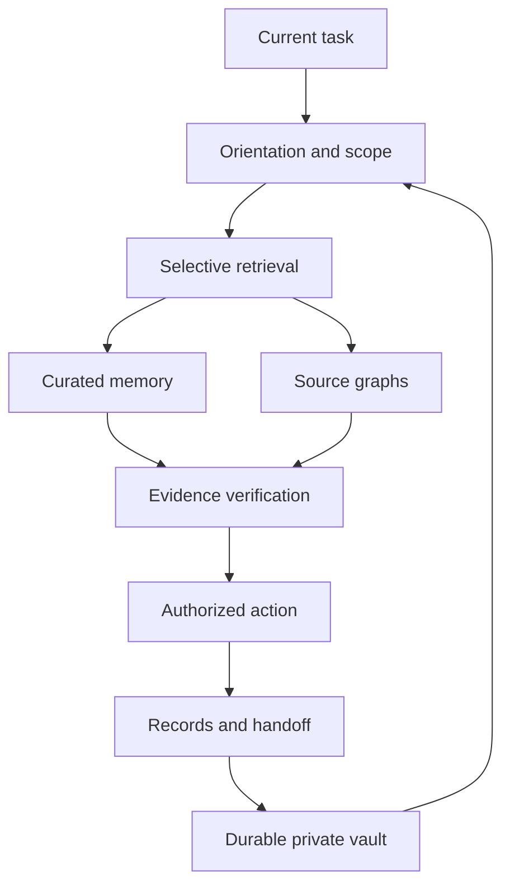

# Architecture

Continuity is one installable skill with a working memory core, four data adapters,
five complete upstream source archives, and isolated native build recipes.
It is not a shared database patched into all four applications. This avoids
pretending that their runtime models or database schemas are interchangeable.

## Storage

SQLite is authoritative for a vault. Records and checkpoints carry exact scopes;
all normal reads filter by scope. FTS5 provides lexical ranking, and a separate
in-process graph layer handles structural lookup and bounded BFS paths. Graphs
are stored by origin, preventing identical upstream node IDs in different exports
from being silently merged. There are no embeddings, hidden network requests,
automatic subjective identity claims, or mandatory remote services.

Records are append-and-supersede. The materialized status is updated transactionally,
while events retain the change history. Events have a per-scope hash chain. Audit
replays expected records/checkpoints and graph hashes and compares them with the
current projection. Snapshots are scope-specific, checksummed, schema-versioned,
and restored atomically into an empty destination scope.

The index caches each file's hash, nodes, and edges. Unchanged content avoids
reparsing; deleted files are removed. Markdown targets absent from the index stay
explicit unresolved nodes. Python definitions have qualified names and line numbers;
line edits may change a node ID, so this is not a permanent symbol identity system.
Imports identify syntactic module names; the core does not resolve Python dynamic
dispatch or infer calls. Native engines provide deeper language analysis.

## Performance boundaries

This is an initial small-project implementation. FTS search is indexed, but a
stored graph is loaded into memory for traversal, and indexing reads all candidate
file bytes to compute content hashes. Large graphs, many versions, or giant
corpora warrant benchmarking and a normalized graph backend. Hash caching saves
parsing, not all filesystem reads. Resume has a character budget; it is not a
model-specific token optimizer.

## Continuity failure modes

| Failure | Behavior |
| --- | --- |
| Missing prior checkpoint | Say no checkpoint; do not invent prior progress |
| Ephemeral workspace reset | Restore the last confirmed durable snapshot |
| Source edited or removed | Mark changed/missing, reverify the claim |
| Multiple active topic records | Surface possible conflict; inspect timeline |
| Untrusted text in memory | Treat as data; no authority to run commands |
| Different project | Scope filtering; explicit import mapping |
| Corrupted snapshot | Reject checksum or audit mismatch; keep target empty |
| Concurrent writers | SQLite serializes writes and chains events |
| Concurrent hosted snapshot forks | Require explicit reconciliation; no silent last-write-wins |
| Dependency missing | Core works independently; native setup reports the actual failure |

## Adding a host integration

Keep the invariant: orient → retrieve → verify → act → checkpoint → confirm durable
save. A host adapter may map lifecycle hooks or MCP calls to these operations, but
it must not promise persistence before the durable write is confirmed. Version 0.2 adds explicit project-local hook setup and a separate lifecycle
coordinator plus native CLI launchers. See references/session-automation.md.
It does not install a daemon or an MCP server. Engram's native MCP server remains available
through its included source if a host needs that runtime.
